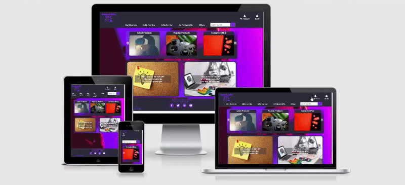
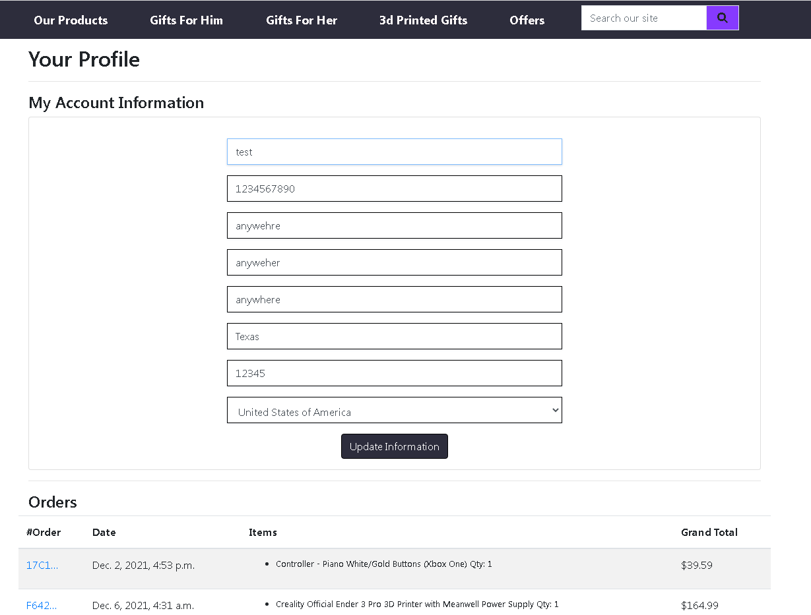
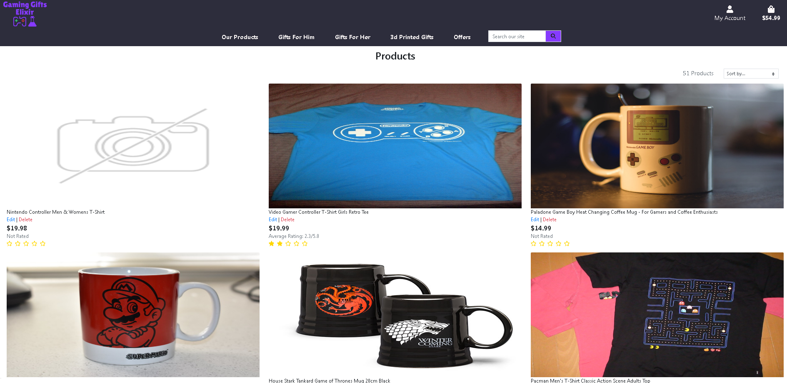
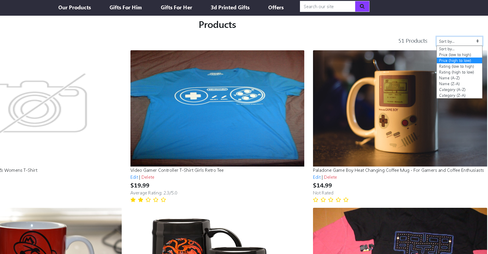
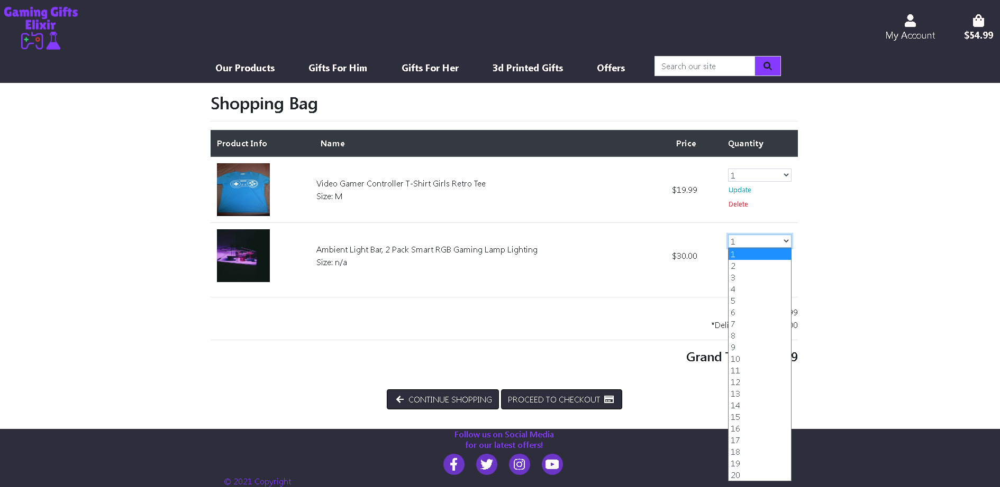
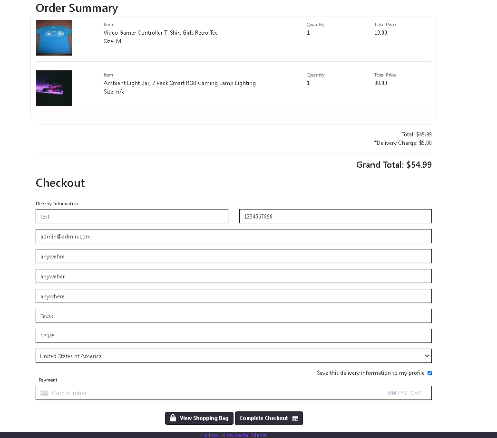
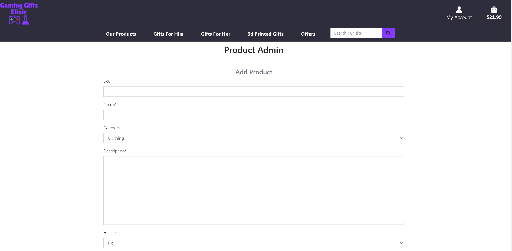
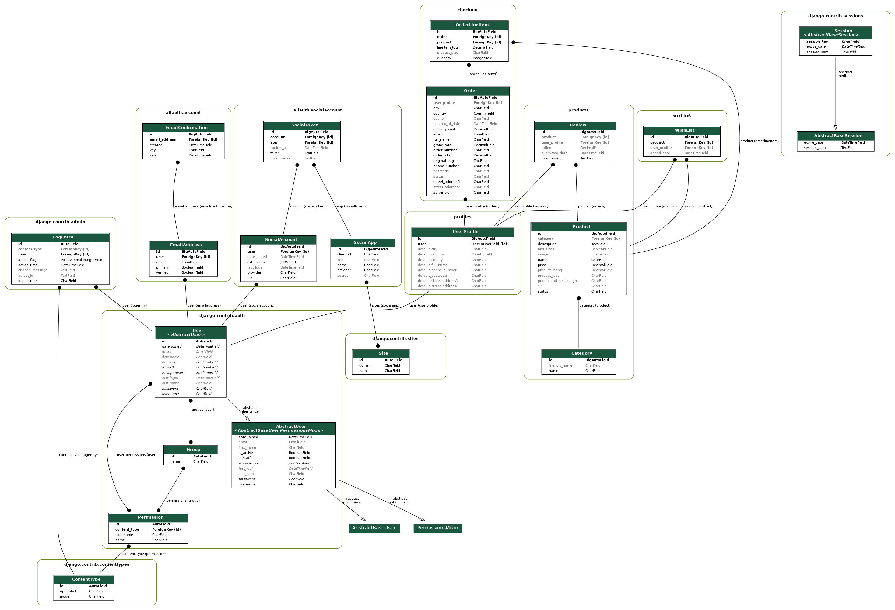

# <div align="center"></div>
[Gamer Gifts Elixir](https://gaming-gifts-elixir.herokuapp.com/) is a website for people trying to find the perfect gift for a loved one who enjoys video games. Finding the right gift can be difficult and this store aims to make that easier. It will have gifts of all kinds related to video games from clothing, office supplies and figurines.

<div><br/></div>
<div align="center">

</div>

## Table of Contents
1. [**UX**](#ux)
    - [**Project Goals**](#project-goals)
    - [**User Stories**](#user-stories)
    - [**Wireframe mock-ups**](#wireframe-mock-ups)
2. [**Features**](#features)
3. [**Technologies Used**](#technologies-used)
4. [**Testing**](#testing)
5. [**Deployment**](#deployment)
6. [**Credits**](#credits)
    - [**Media**](#media)
    - [**Acknowledgements**](#acknowledgements)
    
## UX
### Project Goals
- The primary goal of this project is to create gift store with extremely exciting, cool gifts to make it easy for loved ones to find something amazing for a loved one.
- The website will allow customers to browse the store and find a gift related to video games for their loved one / friend.
- Users will be view different categories of gifts and sort them by rating or price to make finding the right gift even easier.
- This Website will:
    * Be responsive on multiple platforms such as desktops, tablets and smartphones
    * Allow the site owner to add, edit and delete items on the store using CRUD operations so they can manage the site.
    * Allow users to browse new and popular gift ideas so they may find the right one for their friend or loved one.

### Business & Developer Goals
* Create a video game gift store website that allows visitors to view and purchase gifts that are video game related for friends and family.
* This website will be for users who enjoy playing video games or know some one who does, so they may purchase relevant cool and exciting gifts for each other
* Become the go to option to purchase gifts for people who are video game hobbyists. I myself find it extremely difficult to pick the right gift for people I know and this site would make it easier for me with friends and family I know love video games.
* As a developer I would like to 
    - Learn Django, SQL using sqlite and designing a database by creating an exciting project visitors would like to visit and purchase from.
    - A challenging project for the developer but also one that I have a passion for. I love video games and want to create a gift store that sells really high quality exciting gifts that make buying some one a present easy.
### User Stories
 As a video game hobbyist, friend or family member I would like:

#### Browse items & Navigation
1. To be able to navigate the website efficiently and intuitively so that I can find products that will be perfect for me or my loved one for special occasions like birthdays and christmas.
2. View a website / store that contains exciting, new and retro video game related gifts so that I can view and purchase them for some one. 
3. Read the product information so I know what I am purchasing and what to expect when receiving the item.
4. Have a running sum of the total amount I need to pay for the items in the trolly while browsing so that I know how much I am currently about to spend.

#### User Account 
5. Have a quick and seamless account registration procedure.
6. Be able to recover my account password via email incase I forgot it.
7. Be able to quickly and easily login to and log out of my account.
8. Store my information in my account page so I do not need to fill in details like delivery address or keep my basket saved when I return to the site to make it easier for me to purchase.
9. Update my details such as delivery address incase I need to change it.
10. View my order history to track what I have ordered and how much I spent so that I can keep a record.
11. Receive emails such as account registration confirmation or order details so I can keep a record.
#### Sorting & Searching 
12. The ability to browse the store via intuitive and relevant categories so I may find the right gift for the right person easy and efficiently.
13. Use a search bar to so that I can find if specific items or video game items exist.
14. Sort products by price or rating to help me choose the right gift.
#### Checkout & Basket 
15. View all the items I have added to my bag so that I can keep track of the total cost and what I will receive.
16. Add, remove and update quantities of products from my shopping trolly easy and intuitively so that I can purchase the items I want to.
17. Checkout securely via a checkout page that shows exactly what I am receiving and how much I need to pay including delivery cost.
18. Securely and easily enter my payment information so that I can checkout safely and quickly.
19. Receive an order confirmation / status update after clicking the final checkout button so I know my order was successful.
#### Store Management
20. Have the ability to add new products to the store easily so that I can add new exciting products to the store.
21. Edit existing products in the store incase I make a mistake or something about the product needs updating such as price.
22. Delete a product from the store so that I can remove items no longer sold on the website.

### Wireframe mock-ups
- [Home Page](https://github.com/jamesr1775/gamer-gifts-elixir/blob/main/static/read-me/wireframes/home.png)
- [My Account](https://github.com/jamesr1775/gamer-gifts-elixir/blob/main/static/read-me/wireframes/my-account.png)
- [Browse Products](https://github.com/jamesr1775/gamer-gifts-elixir/blob/main/static/read-me/wireframes/browse-products.png)
- [Manage Site](https://github.com/jamesr1775/gamer-gifts-elixir/blob/main/static/read-me/wireframes/site-owner-management.png)
- [Checkout](https://github.com/jamesr1775/gamer-gifts-elixir/blob/main/static/read-me/wireframes/checkout.png)
- [Basket](https://github.com/jamesr1775/gamer-gifts-elixir/blob/main/static/read-me/wireframes/basket.png)
- [Product Info](https://github.com/jamesr1775/gamer-gifts-elixir/blob/main/static/read-me/wireframes/product-info.png)
- [Order Info](https://github.com/jamesr1775/gamer-gifts-elixir/blob/main/static/read-me/wireframes/order-info.png)

## Features
### Navigation
<div align="center"></div>

1. The Nav Bar is a part of the base template and will be present in all webpages of this website. 
2. The register and login options appear when a user is not logged in and disappear when they are. They are accessed via the my account drop down.
3. The my profile and logout options appear when logged in and are accessed via the my account drop down.
4. The basket icon will keep track of the price of all the products in the users basket across all the websites pages.
5. The basket button shows the user the items they added to their basket.
6. The admin account has the extra option of product management on the my account drop down tab so they may add new products.
7. The NavBar becomes a expandable button when the website is accessed on small screens.

### User Account
<div align="center"></div>

1. The register and login button appear in the my account button if a user is not logged in.
2. The registration is quick and easy but requires the account to be verified via an email sent to the user.
3. The users can log in and out of their account seamlessly.
4. The user can store / update their delivery information on their profile page to prefill in forms in the checkout process.
5. In their profile page they can also view all orders they have made.
6. A email will be sent to the user when they make a purchase with the order details.


### Browse items
<div align="center"></div>

1. The our products link shows the user all the products the store has to offer in a responsive manner.
2. The gifts for him drop down menu allows the user to show products by category 
relevant for boys.
3. The gifts for her drop down menu allows the user to show products by category relevant for girls.
4. 3d Printed gifts link shows 3d printed gift ideas and 3d printers.
5. Offers shows the user products on sale.
6. A search field will show products relevant to the search query.

### Sorting & Searching
<div align="center"></div>

1. A search bar in the nav bar allows the user show products relevant to the search query.
2. On the products page, the drop down in the top right allows the products to be sorted by price, name, category and rating

### Basket
<div align="center"></div>

1. Every user can add products to their basket selecting quantity and size.
2. The total cost of the products is calculated and displayed under the basket icon in the top right of the nav bar across all web pages of this application.
3. The basket icon will show the user what is currently in their basket and allow them to update the quantity or remove items from the basket.

### Checkout
<div align="center"></div>

1. The stripe credit card box gives feedback if the user has entered their details incorrectly.
2. When checking out a loader stops the user from interacting with the website until the payment processing has completed.
3. An order details page is loaded upon successful payment.
4. An email and message is displayed to indicate the order went through successfully.

### Store Management
<div align="center"></div>

1. As the site owner, they can access the add product form by going to the product management button in the my account drop down in the nav bar.
2. Admins can also edit existing products via the products pages or products detail page using the edit button.
3. The admin can delete a product from the store via the products pages or products detail page using the delete button.

### Features to implement in the future
1. A wish list so users can watch and create a list of products they are interested in.
2. The other users purchased carousel is currently hard coded. Ideally it would use a third party service for smart recommendations or some database querying to get a number of products that were purchased together.
3. Recommended section based on user interests.
4. Custom 3d printed gifts where the user provides details and requirements of something they want 3d printed.

### Database Design
The 4 main models used are below
1. User Profile
2. Products
3. Orders
4. Order Items

The full data schema and relations is posted in the image:
<div align="center"></div>

Two more models were added after completing the user profile app.

5. Reviews
6. Wishlist

Using django-extensions and GraphViz the models diagram from the final version of the site is below.
<div align="center"></div>

## Technologies Used
* [Heroku:](https://www.heroku.com/)
    - Cloud platform service used to deploy and host the website.
* [Pip:](https://pip.pypa.io/en/stable/installation/)
    - Used to install packages and libraries to run/build the project.
* [Balsamiq:](https://balsamiq.com/)
    - Balsamiq was used to create the wireframes.
* [GitPod:](https://gitpod.io/)
    - GitPod was used as my Editor/ Development Environment.
* [GitHub:](https://github.com/)
    - GitHub is used to store the projects code with version control.
* [Font Awesome:](https://fontawesome.com/)
    - Font Awesome was used throughout to add icons for a more pleasing UX.
* [Slick Carousel:](https://kenwheeler.github.io/slick/)
    - Used for the home page carousel to make it responsive (3 items for large screens, 1 for smaller screens).
* [Amazon Web Services](https://aws.amazon.com/)
    - Used to store static files and images when deployed to heroku.
* [ezgif](https://ezgif.com/video-to-gif)
    - Used to generate gifs used throughout testing, readme and tutorial.
* [dbdiagram.io](https://dbdiagram.io/)
    - Used to create/design the database schema for this project.
* [loading.io](https://loading.io/)
    - Used to create site loading gif.
* [favicon.io](https://favicon.io/)
    - Used to create site favicons.
* [Django-Extensions](https://django-extensions.readthedocs.io/en/latest/)
    - Used to create site favicons.
## Testing
Testing details can be viewed here [Testing.md](https://github.com/jamesr1775/gamer-gifts-elixir/blob/main/Testing.md)


## Deployment

### Creating your own local copy of the source code
- To get a copy of this repo, go to [Gaming Gifts Elixir](https://github.com/jamesr1775/gamer-gifts-elixir), make sure your logged in. You can either 
    - Click the fork button which will create a copy of the repo into your account which is located in the top right hand corner of the link above.
    - If you have git installed on your machine, you can clone the repo with the command
        - git clone https://github.com/jamesr1775/gamer-gifts-elixir
    - Download the zip file of the source code by clicking on the "Code" drop down button located in the top right and clicking "Download Zip"
### Running locally
- In order to run this application locally you must have the following installed on your machine.
    - An Integrated Development Environment such as [Pycharm](https://www.jetbrains.com/pycharm/) or [Visual Studio Code](https://code.visualstudio.com/)
    - [Python3](https://www.python.org/downloads/)
    - [Git](https://github.com/git-guides/install-git)
    - [PIP](https://pip.pypa.io/en/stable/installation/)
- The next step is to install everything listed in the requirements.txt document of the repo. To do that run the command in terminal of the IDE with the project opened:
    - pip install -r requirements.txt.

### Using Heroku to deploy an application
1. A requirements.txt file should be created and kept updated, you can use the terminal command 
    - pip3 freeze > requirements.txt.
    - This project already has one.
2. A Procfile is also required and can be create with the terminal command 
    - echo web: gunicorn your_heroku_app_name.wsgi:application > Procfile.
    - replace the your_heroku_app_name with your correct app name.

3. Commit these files to your repo if they are not already committed.
4. Log in to your [Heroku](https://www.heroku.com/) account
5. Select New button and then select to create a new app.
6. Give your application a name and choose a region located nearest to you.
7. Make sure the correct repo is linked and is selecting the correct branch on your git repository.
8. A database for the static files is required for smoother deployment to heroku. Setup/ Create a new AWS account here [Amazon Web Services](https://aws.amazon.com/).
    - In the search bar once logged in search for S3 and click S3 services. 
    - Create a new bucket to be used for your heroku app choosing a region close to you.
    - Allow public access to this bucket before clicking create and then click create.
    - Navigate to the permissions tab of your new bucket and add the following CORS(Cross-origin resource sharing) config:
        ```
            [
                {
                    "AllowedHeaders": [
                        "Authorization"
                    ],
                    "AllowedMethods": [
                        "GET"
                    ],
                    "AllowedOrigins": [
                        "*"
                    ],
                    "ExposeHeaders": []
                }
            ]       
        ```
    - Now your bucket needs a policy so click on the create / edit policy button and then on the page that follows click the policy generator button.
    - Select the S3 bucket policy from the drop down tab, then select the get Object from the actions drop down menu
    - Copy the generated ARN (Amazon Resource Name) text from the previous screen with the policy generator button and paste it into the ARN field on the policy generator page. Then click create policy. 
    - Copy the generated policy text into the prior screens bucket policy field.
    - Add a "/*" to the ARN name in the resource field and then click save. 
    - The policy should look like the following:
    ```
    {
        "Version": "2012-10-17",
        "Id": "Policy Number ... ",
        "Statement": [
            {
                "Sid": "sid ...",
                "Effect": "Allow",
                "Principal": "*",
                "Action": "s3:GetObject",
                "Resource": "arn:aws:s3:::gaming-gifts-elixir/*"
            }
        ]
    }
    ```
    - The last step is now to create a user and a group that has access to the s3 bucket.
    - Search for IAM in the search bar in AWS page and click Identity and Access Management.
    - Click the create a new group and create your new group for this project.
    - Give your new group a policy by clicking the the policies tab and create a policy with the  
    the import managed policy and search for and add the S3 Full access policy. Give the policy a name and create it.
    - Attach the policy to the new group you create with the IAM. 
    - Create a new user that will be added to the new group. Give them programmatic access when creating the new user.
    - When added to the group you will now have a CSV file to be downloaded with the AWS secret key Id and password that will be used in the next steps (step 10). Store this CSV safely as you may only download it once.
9. Create a Stripe account
    - Go to the developers webhook section and click add endpoint
    - Enter the heroku url of your application and add /checkout/wh/ to the url in the box that says Endpoint Url. e.g (https//appname.herokuapp.com/checkout/wh/)
    - Then click add all events, then click add endpoint.
    - Now you should have access to stripe secret and pubic keys for the config variables required below.
10. I used the gmail account for the automated emails for user authentication and order emails.
    - Once created go manage your google account and go to the security section.
    - Create an app password for email service that will be EMAIL_HOST_PASS variable below.
    - The EMAIL_HOST_USER variable below is the gmail account email you created.
11. Click the settings button of the app and click the reveal config variables button.
12. Enter the following config variables:

| Key | Value |
 --- | ---
SECRET KEY | `<your_secret_key>`
AWS_ACCESS_KEY_ID | `<your_aws_access_key_id>`
AWS_SECRET_ACCESS_KEY | `<your_aws_access_key>`
USE_AWS | True
DATABASE_URL | `<your_data_base_url>`
EMAIL_HOST_PASS | `<your_email_host_password>`
EMAIL_HOST_USER | `<your_email_host_email_name>`
STRIPE_PUBLIC_KEY | `<your_stripe_public_key>`
STRIPE_SECRET_KEY | `<your_stripe_private_key>`
STRIPE_WH_SECRET | `<your_stripe_webhook_secret_key>`

13. Connecting to the S3 bucket the following should be added to the settings.py file of your django project. This is already to this project if you cloned the repo from the main branch.
    ```
        if 'USE_AWS' in os.environ:
            AWS_STORAGE_BUCKET_NAME = 'gaming-gifts-elixir'
            AWS_S3_REGION_NAME = 'eu-west-1'
            AWS_ACCESS_KEY_ID = os.environ.get('AWS_ACCESS_KEY_ID')
            AWS_SECRET_ACCESS_KEY = os.environ.get('AWS_SECRET_ACCESS_KEY')
            AWS_S3_CUSTOM_DOMAIN = f'{AWS_STORAGE_BUCKET_NAME}.s3.amazonaws.com'

            STATICFILES_STORAGE = 'custom_storages.StaticStorage'
            STATICFILES_LOCATION = 'static'
            DEFAULT_FILE_STORAGE = 'custom_storages.MediaStorage'
            MEDIAFILES_LOCATION = 'media'

            STATIC_URL = f'https://{AWS_S3_CUSTOM_DOMAIN}/{STATICFILES_LOCATION}/'
            MEDIA_URL = f'https://{AWS_S3_CUSTOM_DOMAIN}/{MEDIAFILES_LOCATION}/'
    ```
14. Run the show migrations command in the terminal to see if you need to apply migrations to your new database.
    - run the command:  `python3 manage.py showmigrations`
    - If you need to make migrations run the command `python3 manage.py makemigrations`
    - Now run the migrate command to `python3 manage.py migrate` to apply the migrations.
15. Your app should be ready for deployment now so click on Deploy button on the your heroku app page.
16. Enable automatic deployment so new changes get deployed automatically.

## Issues
- It was difficult to get license free images that are related to the store I wanted to build so I had to make do
with what I could find. Some of the images might be a little distorted as they vary in size alot. If this store was 
real I would take my own images and make sure they are all uniform size to prevent this.

## Credits
### Media
- [Free Logo Design](https://www.freelogodesign.org/)   -   Created the Company logo.
- [Photo by Karolina Grabowska from Pexels](https://www.pexels.com/photo/a-red-sale-tags-on-red-and-black-background-5625008/)  -   Offers/Sales
- [Photo by Anthony from Pexels](https://www.pexels.com/photo/xbox-one-controller-beside-three-xbox-one-cases-139038/)   -  Popular Products
- [Photo by Andrea Piacquadio from Pexels](https://www.pexels.com/photo/man-wearing-white-virtual-reality-goggles-834949/)  -   latest products
- [Image by ZMorph3D from Pixabay](https://pixabay.com/photos/3d-printing-3d-technology-tech-3758154/)  -   3d printing gifts
- [Photo by AbsolutVision on Unsplash](https://unsplash.com/photos/82TpEld0_e4)     -   Gift Advice
- [Photo by ZMorph3D on Pixabay](https://pixabay.com/photos/printer-technology-3d-printer-4348147)     -   Printing Info
- [Photo by Luis Villasmil on Unsplash](https://unsplash.com/photos/ITFwHdPEED0)    -   home background image
- [Photo by Kira auf der Heide](https://unsplash.com/photos/IPx7J1n_xUc)    -   gift advice page
- [Teaching Tech](https://www.youtube.com/watch?v=T-Z3GmM20JM&t=1s)    -   Printing Video

The product images used are in the following [text file](https://github.com/jamesr1775/gamer-gifts-elixir/blob/main/static/read-me/media_product_references.txt)
### Acknowledgements
Huge thanks to my mentor Miguel Martinez for helping me, providing great insights and reviewing my progress over the course of this project.

- [1] This answered question helped me with the jquery for styling the rating stars based on fractional rating [stackoverflow](https://stackoverflow.com/questions/37562892/jquery-font-awesome-star-rating-default-value/37563393)
- [2] Used the javascript and html from the course for the sorting selector [Code-Institute GitHub](https://github.com/Code-Institute-Solutions/boutique_ado_v1)
- [3] Got information about how to get the product size when deleting from the basket to the remove view from the question answered here [stackoverflow](https://stackoverflow.com/questions/67535665/pass-a-get-parameter-from-html-and-receive-in-django-view).
- [4] Utilized Django docs to learn more about forms and models. [docs.djangoproject](https://docs.djangoproject.com/en/3.2/ref/forms/fields/)
- [5] Learnt how to change the rating in the review form to a drop down menu from [stackoverflow](https://stackoverflow.com/questions/55477387/django-modelform-doesnt-work-with-decimal-field).
- [6] Was able to remove the no choice option added to the rating input in the review form by using the information I read on a stackoverflow question [stackoverflow](https://stackoverflow.com/questions/8798763/django-how-to-remove-the-blank-choice-from-the-choicefield-in-modelform)
- [7] Checking whether the user has purchased the item aws tricky. This helped me solve the issue as profile was part of a foreign key in the order line items [docs.djangoproject](https://docs.djangoproject.com/en/3.2/topics/db/examples/many_to_one/#many-to-one-relationships).
- [8] Required a for loop counter in products template, got some info at [stackoverflow](https://stackoverflow.com/questions/11481499/django-iterate-number-in-for-loop-of-a-template).
- [9] Required modulo operator to add horizontal dividers for large - medium screens every 3 products and then every two for small screens and none for xs screens, got some info at [stackoverflow](https://stackoverflow.com/questions/8494209/modulus-in-django-template/8494425).
- [10] The site pre loader code was obtained from [stackoverflow](https://stackoverflow.com/questions/30478549/pre-loader-image-at-page-load-issue) and [smallenvelop](https://smallenvelop.com/display-loading-icon-page-loads-completely/).
- [11] Thanks to Sean Young for posting how to generate a image of the django models in the code institute slack community.
- [12] For some of the products descriptions I searched for related products on amazon to help speed up building relevant descriptions of the products for my database.