# Gaming Gifts Elixir Testing
The deployed version of the Sorting Visualiser can be found at [Gaming Gifts Elixir](https://gaming-gifts-elixir.herokuapp.com/).

The source code for the project can be viewed at [github](https://github.com/jamesr1775/gamer-gifts-elixir/).

## Table of Contents

1. [**Testing**](#testing)
    - [**Code Validation**](#code-validation)
2. [**User Stories Tests**](#testing-user-stories)
4. [**Automated Testing**](#automated-testing)
5. [**Manual Testing**](#manual-testing)
    - [**Site Header**](#site-header)
6. [**Further Testing**](#further-testing)
7. [**Bugs and Issues Resolved**](#bugs-and-issues-resolved)
8. [**Unsolved Bugs**](#unsolved-bugs)

## Testing
### Code Validation
* The HTML passed and showed no errors in the [W3C Markup Validation](https://validator.w3.org/)
* The CSS passed and showed no errors in the [W3C CSS validation ](https://jigsaw.w3.org/css-validator)
* The Java Script was tested and no errors were found using [JSHint](https://jshint.com/)
* The python Pep8 standard was checked with the IDE using [flake8](https://flake8.pycqa.org/en/latest/)
### Testing User Stories
#### Browse items & Navigation
1. To be able to navigate the website efficiently and intuitively so that I can find products that will be perfect for me or my loved one for special occasions like birthdays and christmas.
    - The navbar is fixed to the top of the page is the same across all views.
    - Links are in the navbar to show products based on category.
2. View a website / store that contains exciting, new and retro video game related gifts so that I can view and purchase them for some one. 
    - There are over 50 products related to gaming / pop culture that users access via the products links.
3. Read the product information so I know what I am purchasing and what to expect when receiving the item.
    - Each product has a product detail page that shows the user more information about the product.
4. Have a running sum of the total amount I need to pay for the items in the trolly while browsing so that I know how much I am currently about to spend.
    - When an item is added to the basket, a running sum is kept of the total price of the products currently in the basket.

    
 

    

    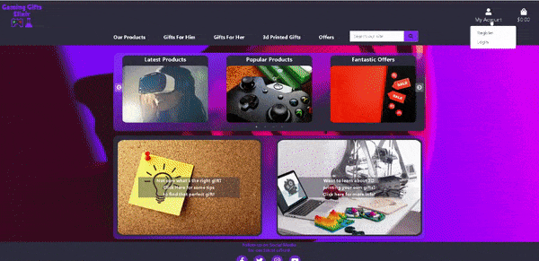
    

#### User Account 
5. Have a quick and seamless account registration procedure.
    - The register feature is quick and seamless with only 5 fields in the register form.
6. Be able to recover my account password via email incase I forgot it.
    - The forgot password button allows user to enter email to get a link to reset their password on their account.
7. Be able to quickly and easily login to and log out of my account.
    - The log in and out buttons work as expected.
8. Store my information in my account page so I do not need to fill in details like delivery address or keep my basket saved when I return to the site to make it easier for me to purchase.
    - The user profile can store delivery information and can autofill the order form if saved.
9. Update my details such as delivery address incase I need to change it.
    - In the profile page the user can edit their saved information.
10. View my order history to track what I have ordered and how much I spent so that I can keep a record.
    - In the profile page order history is shown to the user.
11. Receive emails such as account registration confirmation or order details so I can keep a record.
    - Emails are received to verify account email and when orders are successful.

    
 

    

    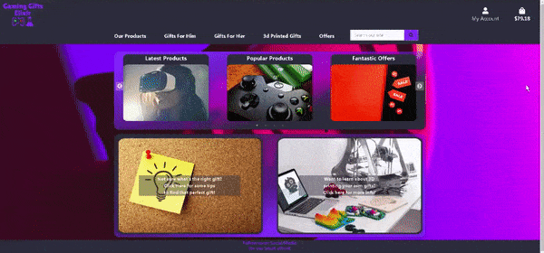
    

#### Sorting & Searching 
12. The ability to browse the store via intuitive and relevant categories so I may find the right gift for the right person easy and efficiently.
    - The main nav bar provides useful links to filter and display products based on categories.
13. Use a search bar to so that I can find if specific items or video game items exist.
    - The search bar will show relevant products related to the users search query.
14. Sort products by price or rating to help me choose the right gift.
    - The drop down filter sorts the products displayed based on price, name, category or rating.

    
 

    

    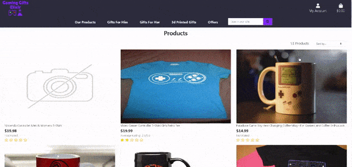
    

#### Checkout & Basket 
15. View all the items I have added to my bag so that I can keep track of the total cost and what I will receive.
    - The products added to the basket are shown in a user friendly table when the user clicks the basket icon in the navbar.
16. Add, remove and update quantities of products from my shopping trolly easy and intuitively so that I can purchase the items I want to.
    - Next to all items in the basket an update quantity and delete item from basket option is available.
    - The total is adjusted based on any changes made.
17. Checkout securely via a checkout page that shows exactly what I am receiving and how much I need to pay including delivery cost.
    - The stripe credit card box is in the checkout form and provides the user with error information if necessary.
18. Securely and easily enter my payment information so that I can checkout safely and quickly.
    - Stripe payments and some javascript enable safe payments using webhooks and disabling the website / forms buttons.
19. Receive an order confirmation / status update after clicking the final checkout button so I know my order was successful.
    - When an order is successful a message and email is sent to user with the order information.

    
 

    

    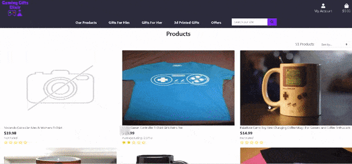
    

#### Store Management
20. Have the ability to add new products to the store easily so that I can add new exciting products to the store.
    - Under the product management of the admins my account, he/she can add products to the store.
    - The form provides feedback if some product fields are required or are incorrect / invalid .
21. Edit existing products in the store incase I make a mistake or something about the product needs updating such as price.
    - If the admin is logged in the edit button is shown with each product in all the products pages and product detail page.
    - This button preloads the product form with the current product values.
    - If the form is submitted the product updates the changes made.
22. Delete a product from the store so that I can remove items no longer sold on the website.
    - If the admin is logged in the delete button is shown with each product in all the products pages and product detail page.
    - If the delete button is pressed the admin is brought to a confirmation delete form.
    - If confirmed deletion, then the product is removed from the store.

    
 

    

    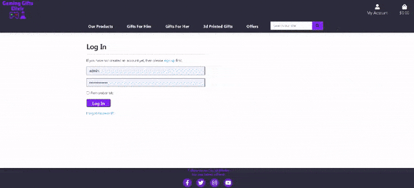
    

### Automated Testing
The python views, forms and models were tested using [Django Unit Testing](https://docs.djangoproject.com/en/3.2/topics/testing/overview/).
A total of 65 unit tests were written and all pass without errors or warnings.
These tests were ran regularly and before each big commit to the working branch.
    
 

    

    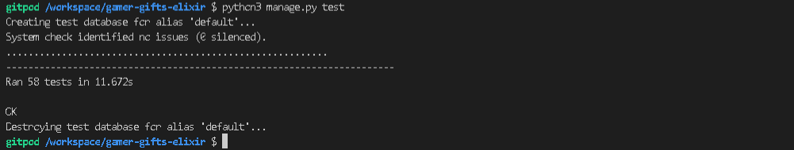
    

 

### Manual Testing
* All manual tests below:
    - were ran on chrome and firefox.
    - were repeated on various screen resolutions using the chrome and firefox developer tools that include desktops, ipad, ipad pro, iphone X, 5, 6 ,7 , 8 and the plus models.
    - were repeated on the developers own smartphone (samsung) and tablet (ipad), desktop and laptop.

#### Site Header, Footer & Hero Image

##### Device Specific Layout Checks
- The Header responsiveness was tested by varying the screen size to see that the logo and navbar links were responsive and also that the navbar becomes an expandable burger icon on smartphones.
- The logo stays to the left of the header on all screens with the my account and basket links to the right of the page.
- The website navigation links should be under the logo, the account and the basket links on large screens. When the burger icon is clicked the links should be on the left side of the screen.
- The search bar should be next to the product / offers links on large screen sizes and should be on its own row for smaller screen sizes.

##### Site Header Tests
- The logo was tested that when it is pressed it returns / refreshes to the home page.
- All the product navigation links work and bring the user to the correct products page with the correct products displayed depending on the category selected.
- The nav menu links with a drop down menu should be easily clickable and the drop down menu stays open until another click occurs.
- The search bar functions correctly and displays products related to the users search queries.

 

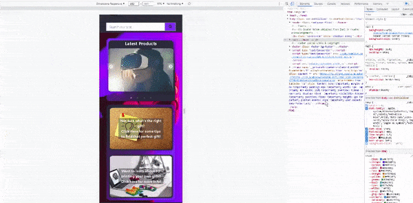

##### Site Footer Tests
- The social media icons opens up the relevant social media platforms in a new tab.
- The icons remain centered on all screen sizes.
- The Copyright Info text stays under the icons to the left side of the screen.

#### Home Page Tests

##### Home Carousel
- The Carousel should be responsive and show 3 columns / items for large screens and then 1 column / item for smaller screen sizes (less than 768px).
- The images should remain undistorted when adjusting the screen size.
- The Navigation buttons to cycle through the items in the carousel should increment / decrement the slide index by 1 shifting the cards to the right or left.
- The slider should show which card is in the left most position using carousel dots displayed at the bottom. They should remain centered on all screens at the bottom of the carousel.
- The navigation buttons should remain within the carousel card.
- All the drop down product pages should retrieve and display the correct products that are related to the drop down option selected.
- The sorting drop down options should sort the products correctly depending on the sort option.

 

##### Tips / Print Info Cards
- The gift tips and information callout cards should be side by side on tablets and larger screen sizes. 
- On smart phones they should be both on separate rows.
- The cards should be above the footer and under the carousel.
- The images are to remain undistorted for all supported screen resolutions.
- The gift advice card brings the user to the gift advice page when clicked.
- The printing info card brings the user to the printing info page when clicked.
    
 

    

    
    

#### Products Page Tests

##### All Products
- On large screens and laptops the products page contains 3 products per row with their image, name, price and rating showing.
- The images should adjust to not be distorted for different screen sizes.
- The images in each row remain aligned and are the same heights.
- The name, price and rating should remain under the image and hug the left side of the container they are in.
- The text should remain aligned to the other products text, left and right of the product they belong to. (The price is aligned to price, rating aligned to other ratings in the same row)
    
 

    

    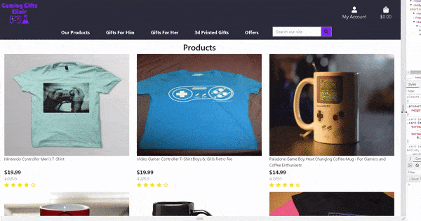
    

##### Product Detail Pages
- The image of a product on the products page should open up the products details page.
- The description, name, rating, price, quantity, size, add to basket and continue shopping buttons should be displayed to the user on the right of the image on large/medium screens and should appear under the image on smart phones screens.
- The continue shopping button should return the user back to the all products page.
- The reviews and other customers purchased sections should be on separate rows under the item image and description.
- The add to basket button updates the shopping bag with the correct product, product size and quantity.
- The bag in the nav bar should contain the correct grand total depending on the items in the shopping bag.
- If the user tries to add too much of one product multiple times they are not able to and thus receive a message telling them of this issue.
- The add review button appears if the user has purchased the product but not reviewed it yet and it should bring the user to the products review page when pressed.
- The add review button disappears when a user has submitted a review. Their review is then shown to them under the aggregated review score.
- The update and delete review buttons are present on the users review.
- The update button brings the user to the edit review page and preloads their current reviews information into the form.
- The delete review button brings the user to a confirmation page asking them to confirm if they wish to delete their review.
- The average users rating and the logged in users rating is correctly displayed.
- The correct gold stars and half colored stars appear for the ratings value.
    
 

    

    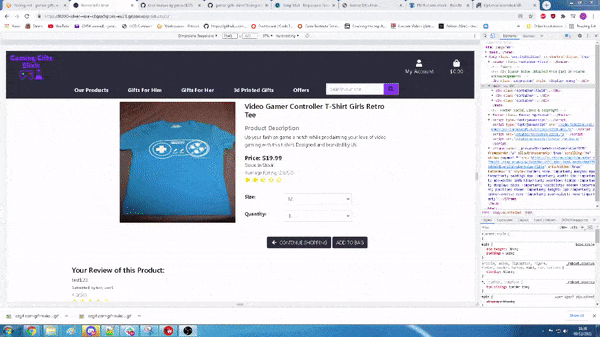
    

##### Add Product
- Admin users can access this page by going to the product management section of My account drop down or by modifying the url.
- Non super users or logged out users should not be able to access the add products form.
- The form and headers should remain centered on the screen for all screen sizes. On smart phones and tablets the width changes to 100% instead of 60%.
- The form text headings should remain to the left border of their input field boxes.
- The choose file and image text remain centered under the last input text field box. 
- The choose image box opens the users explorer for them to select and upload a file.
- The cancel and add product button remain centered under the choose image button.
- The cancel button returns the admin to the all products page.
- The form validators work as expected and do not allow the admin to add the product if required inputs are wrong or missing. A popup should be displayed to the user if the add product button is pressed and the form is not valid.
- If the form is valid the admin is brought to the newly created products detail page after clicking the add product button.
- The cancel button returns the admin to the all products page.

##### Edit Product
- Admin users can access this page by clicking the edit button on the products and products details pages.
- Non super users or logged out users should not be able to access the edit products form.
- All fields of the form should be prefilled in with the selected products fields in their correct input box.
- The form and headers should remain centered on the screen for all screen sizes. On smart phones and tablets the width changes to 100% instead of 60%.
- The form text headings should remain to the left border of their input field boxes.
- The choose file and image text remain centered under the last input text field box. 
- The choose image box opens the users explorer for them to select and upload a file.
- The cancel and update product button remain centered under the choose image button.
- The cancel button returns the admin to the all products page.
- The form validators work as expected and do not allow the admin to update the product if required inputs are wrong or missing. A popup should be displayed to the user if the update product button is pressed and the form is not valid.
- If the form is valid the admin is brought to the updated products detail page after clicking the update product button.
- The clear checkbox if checked should remove the current image of the product.

##### Delete Product
- Admin users can access this page by clicking the delete button on the products and products details pages.
- Non super users or logged out users should not be able to access the delete products page.
- The Product image, name and description are side by side on medium screens and larger with the text under the image on mobiles.
- The cancel and delete product button remain centered under product image / info.
- The cancel button returns the admin to the all products page.
- The delete button on the delete_product.html page will delete the correct product from the store and return the user to the products page.

    
 

    

    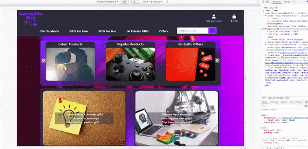
    

##### Add Product Review
- users who purchased this product can access the product review page by clicking the add review button on the product details page.
- users who did not purchase the product or logged out users should not be able to access the add product review form.
- The form text headings should remain to the left border of their input field boxes.
- The cancel and submit review button remain centered under the form.
- The cancel button returns the user to the products detail page.
- The form validators work as expected and do not allow the user to add the review if required inputs are wrong or missing. A popup should be displayed to the user if the submit form button is pressed and the form is not valid.
- If the form is valid the user is brought to the products detail page after clicking the submit review button.

##### Edit Product Review
- users who purchased this product and have created a review can access the edit product review page by clicking the update review button on the product details page in the review section.
- users who did not create the review or logged out users should not be able to access the edit product review form.
- The form text headings should remain to the left border of their input field boxes.
- The edit review form should be prefilled in with the users current review information of the product.
- The cursor should be in the user review text description box.
- The cancel and update review button remain centered under the form.
- The cancel button returns the user to the products detail page.
- The form validators work as expected and do not allow the user to add the review if required inputs are wrong or missing. A popup should be displayed to the user if the update form button is pressed and the form is not valid.
- If the form is valid the user is brought to the products detail page after clicking the update review button.

    
 

    

    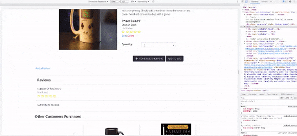
    

##### Delete Product Review
- users who purchased this product can access the delete product review page by clicking the delete review button on the product details page.
- users who did not create the review or logged out users should not be able to access the delete product review form.
- The user is shown his / her review of the product with confirmation buttons to delete or cancel their actions to delete the review.
- The text headings should remain on the center of the screen.
- The cancel and delete review button remain centered under the form.
- The cancel button returns the user to the products detail page.
- The delete review button, deletes the users review and returns the user back to the products detail page where the add review button now exists and the update/ delete review buttons are gone.

#### Shopping Bag Page Tests
##### Shopping Bag Layout 
- The table of products in the users bag should be the same layout wise except for on mobile phones when the continue shopping and proceed to checkout buttons are on separate rows. 
- The images in each row remain aligned and are the same heights/ widths.
- The name, price and quantity should remain in their divs and the text is smaller for small screen sizes.

##### Shopping Bag Functionality 
- When no products are in the users bag, the shopping bag page should tell the user that their bag is empty.
- When products are added to the bag they should appear in a table with the price, quantity and buttons to adjust or remove items from their bag.
- The product image loads the products detailed page view.
- The delete button removes the item completely from the users shopping bag.
- The update button changes the quantity of an item to that of the quantity input drop down.
- If a user tries to add more the the maximum threshold allowed they should receive a message telling them they have too much of one product in their bag.
- When products are removed and added the grand total, delivery and total cost is adjusted to reflect the correct value for the current state of the shopping bag.
- The continue shopping button should return the user to the products page.
- The proceed to the checkout button should bring the user to the checkout page.
- The proceed to the checkout button is only present if the bag is not empty.
    
 

    

    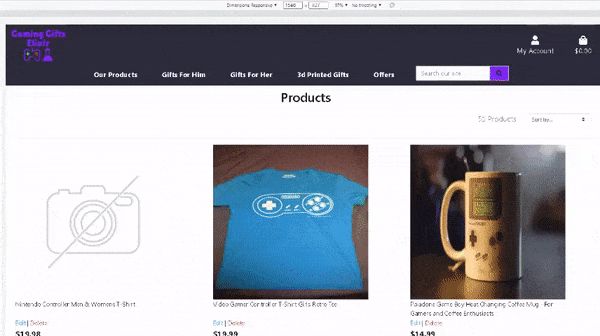
    

#### Checkout Tests
##### Checkout Layout
- A table of the products in the shopping bag should be present on the top of the checkout page.
- The total, delivery cost and grand total text is under the products table and hugs the right side of the screen.
- The full name and phone number fields are on the same row for large screens and tablets and are on different rows for smart phones.
- The rest of the fields and the credit card details are all on different rows.
- The view shopping bag and complete checkout buttons are on the same row for all screen sizes except for small screens < 435px  where they are on separate rows.  

##### Checkout Functionality 
- The checkout forms required fields should all be complete before the form can be correctly posted.
- When a field is incorrect or missing upon trying to submit the form the user should get a pop up on the field that is incorrect telling them. 
- If the credit card fields are incorrect they should also receive feedback.
- The view shopping bag button returns the user to their shopping bag.
- When all the details in the form and credit card info are valid, the complete checkout button should process the users order. 
    - The complete checkout button is frozen and a processing spinner is loaded to stop the user from submitting the form again by accident.
    - When the order has been processed the user is brought to the checkout success page.
    - An order success message is loaded in the top right of the page.
    
 

    

    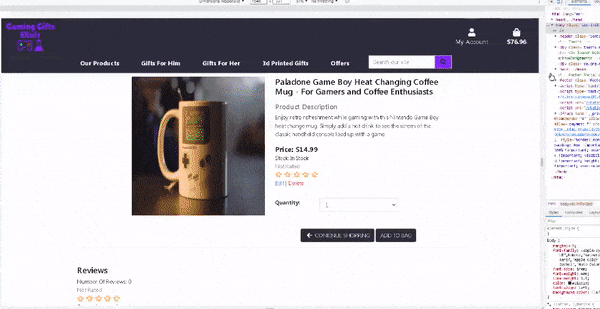
    

##### Checkout Success Layout
- The checkout success page shows the user the delivery information submitted, the order details and the billing information.
- The text should hug the left side of the container.
- The fields are all on separate rows.

##### Checkout Success Functionality 
- When the continue shopping button is pressed, it should take the user back to the products page.
- An email should be sent with the order information.

#### Profile Tests
- A form with the users details is present on the home page.
- If the user made an order and clicked the save info, then this form is prefilled with the users saved information.
- The user can update their information easily with the form.
- The order history is presented to the user at the bottom of the profile page in a table.
- Clicking an order number will bring up the order details page.

#### WishList Tests 
##### WishList Page
- WishList Page is tested the same as the products page as its the same template code.
- A remove product from wishlist button is added underneath the product name.
##### WishList Add Product
- The add product to wishlist button is visible to logged in users on the product details page.
- The add product to wishlist button adds the product to the users wishlist.
##### WishList Remove Product
- The remove product from wishlist button exists on the products detail page if the product is in the users wishlist.
- The remove product from wishlist button exists on wishlists page.
- The remove product from wishlist button removes a the product from the users wishlist.

    
 

    

    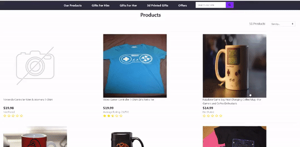
    

#### Further Testing
- I asked friends and family to test and interact with the site on their own devices which included ipads, iphones and samsung phones.
- Tested myself on physical devices laptop, desktop, ipad, samsung phone, iphone.

### Bugs and Issues Resolved
- Having trouble with content appearing over/under the footer, found some information that helped from [stackoverflow](https://stackoverflow.com/questions/19330611/fixed-footer-in-bootstrap) where I was suggested to use 70 or 100vh for the content block.
- Initial test_products_detail_view was throwing a 404 error. Eventually figured out that the others_bought_ids in the view was throwing the exception as the 
products_others_bought in the product created in the test case setUp function did not exist and thus trying to split an empty string in the product_detail view. 
Fixed this by adding an if clause in the view.
- If a product is added without an image, the website no longer crashes as a default no product image is loaded instead.
- Reviews added before the userprofile was added to the model caused the website to crash. Fixed by adding the profile in the django admin page.
- Fixed a bug where sorting popular or latest products caused a crash. 
`AssertionError: Cannot reorder a query once a slice has been taken.` Found this info here [djangoproject](https://docs.djangoproject.com/en/1.8/ref/models/querysets/)
Instead of slicing the products query I created a dictionary of the same products and used it to get the products I need in the correct sort order.
### Unsolved Bugs
Currently no known bugs.